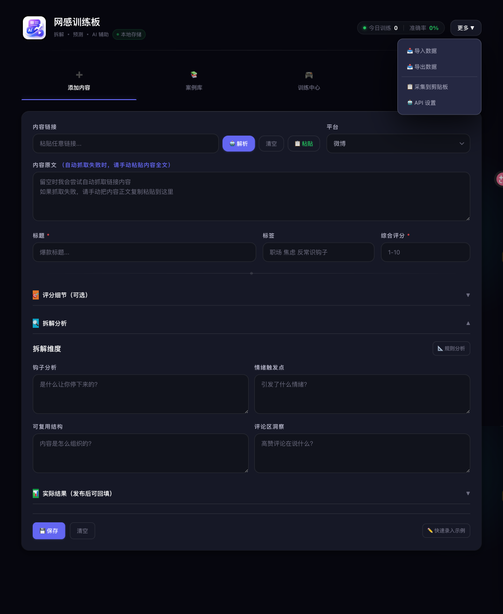
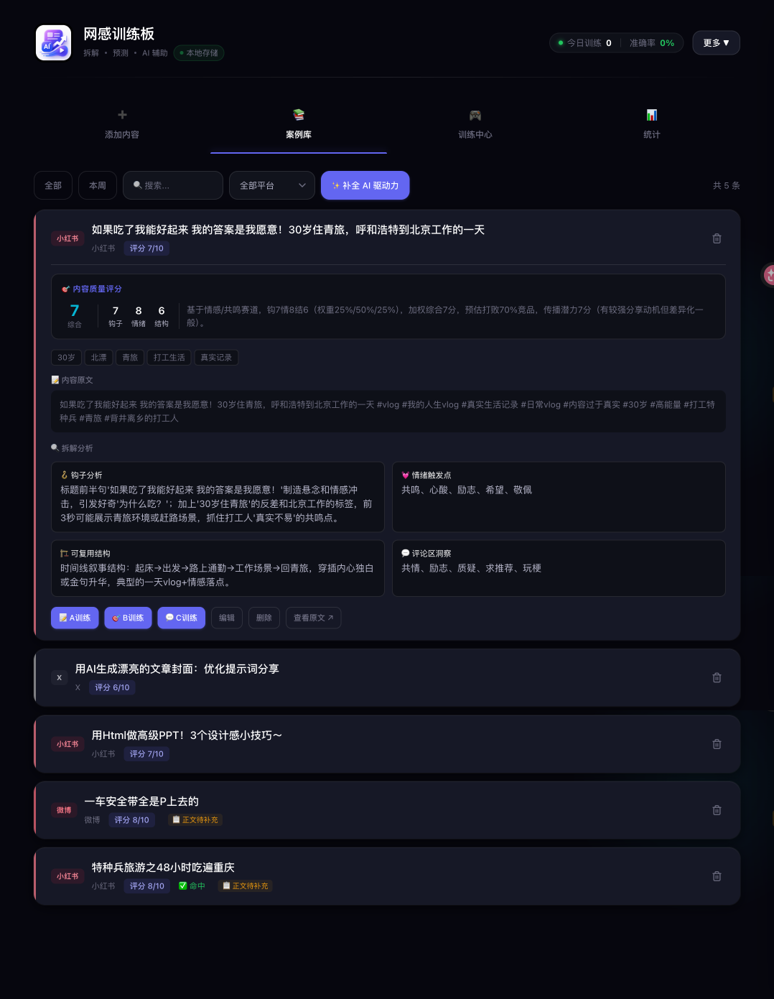
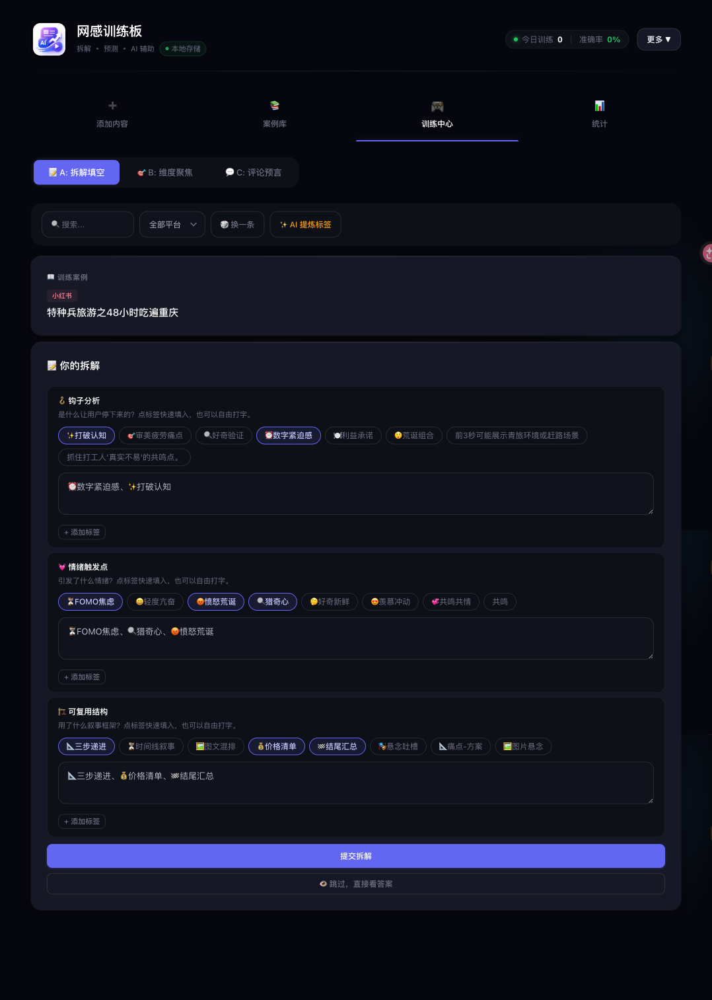
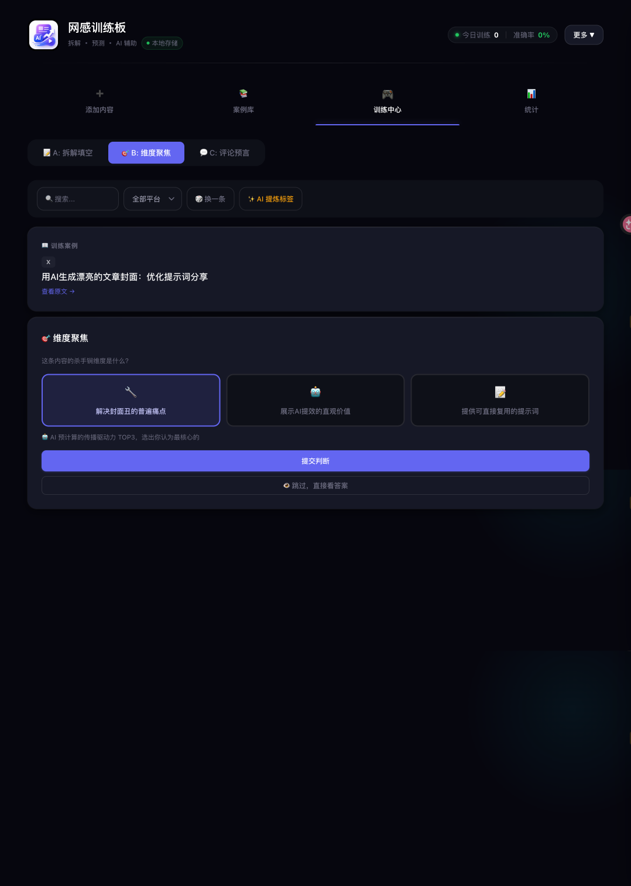
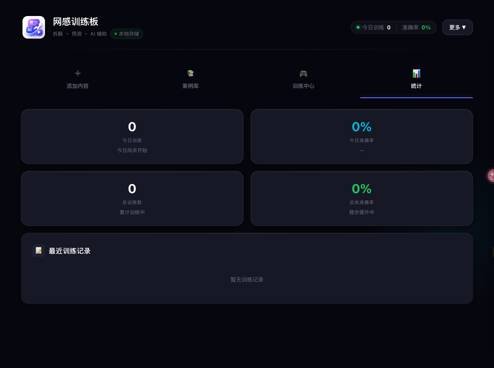

# 网感训练板

一个单文件 Web 应用，帮助内容创作者系统化训练对爆款内容的敏感度——拆解钩子、识别情绪触发点、预判传播方向。

  
  
  

  
  

## 核心功能

| 模块 | 功能 |
|------|------|
| **添加内容** | 粘贴链接自动解析，手动录入案例，AI 辅助提取标签；支持评分（钩子/情绪/结构）、拆解分析、评论区洞察 |
| **案例库** | 本地存储所有案例，支持按平台/时间筛选，搜索标题和标签；可编辑、删除、训练 |
| **训练中心** | 三种训练模式： • **A: 拆解填空** — 看到内容后自己拆解钩子、情绪、结构，再对答案 • **B: 维度聚焦** — 判断一条内容的最强传播维度（钩子/情绪/结构/平台红利） • **C: 评论预言** — 预测最高赞评论的方向 |
| **统计面板** | 六边形雷达图展示各平台网感分布，准确率趋势、训练记录 |

## 技术栈

- **纯前端**：单 HTML 文件，无构建步骤
- **样式**：原生 CSS + Tailwind CDN
- **存储**：localStorage（完全本地，无服务端）
- **AI 集成**：OpenAI 兼容 API（可选，用于自动解析和标签提炼）

## 设计特点

- 深色主题，分层背景（page → card → inner）
- 紫→青渐变品牌色
- Segmented Control 模式切换器
- 卡片悬浮动效 + 入场动画
- 全响应式（移动端 2 列，桌面端 4 列）

## 快速开始

1. 用浏览器打开 `网感训练板.html`
2. 在「添加内容」页粘贴一条爆款链接，点击「解析」
3. 填写评分和拆解分析，保存到案例库
4. 切换到「训练中心」，选择 A/B/C 模式开始训练
5. 在「统计」页查看自己的网感雷达图

## 数据安全

所有数据保存在浏览器本地（localStorage），不会上传到任何服务器。支持导入/导出 JSON 备份。
