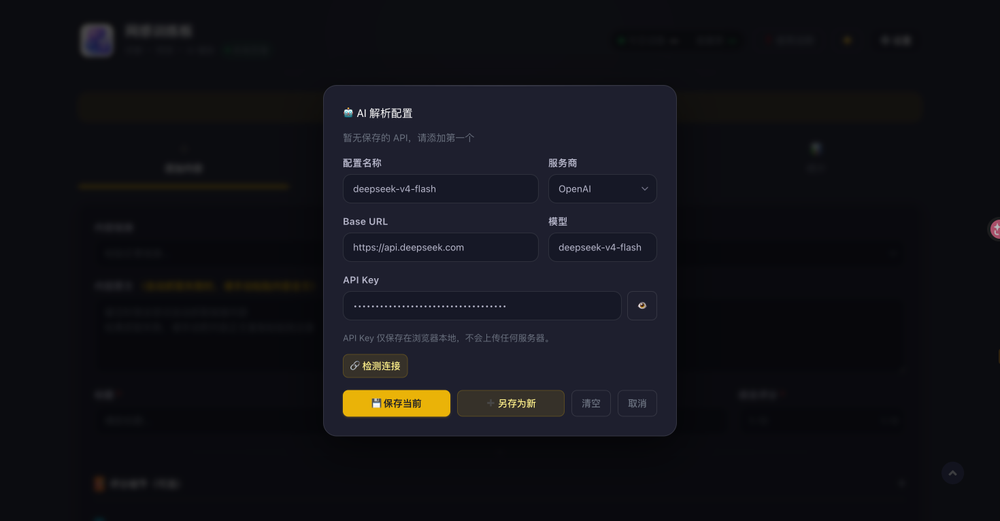
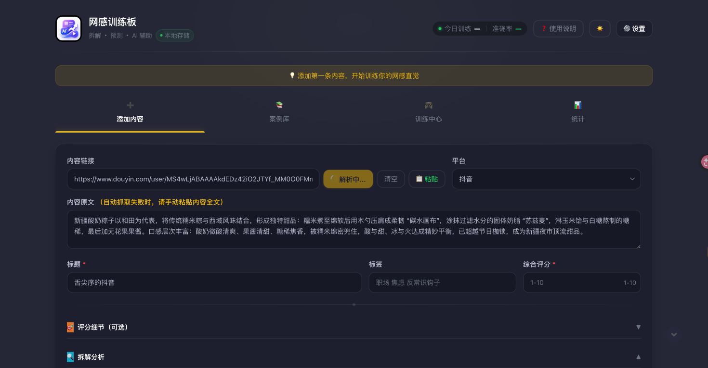
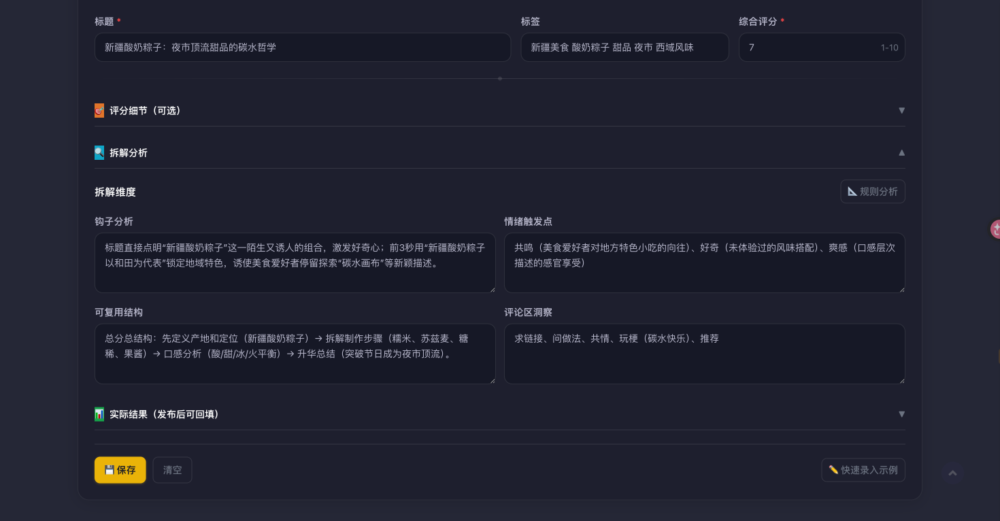
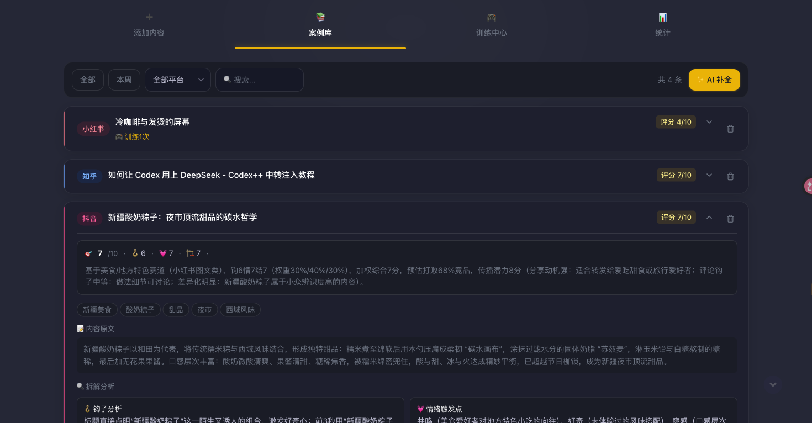
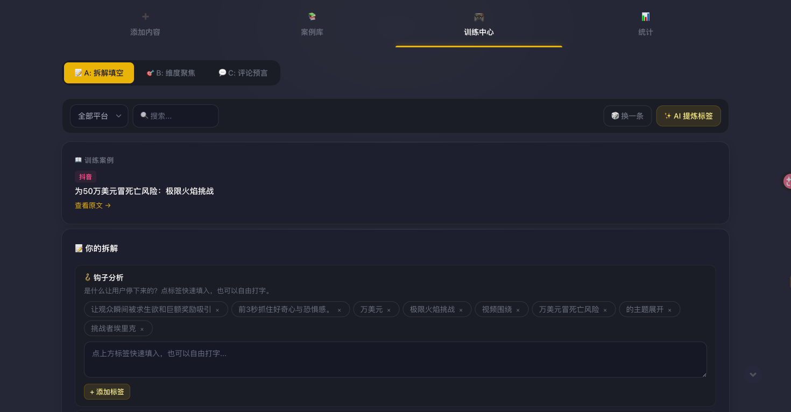
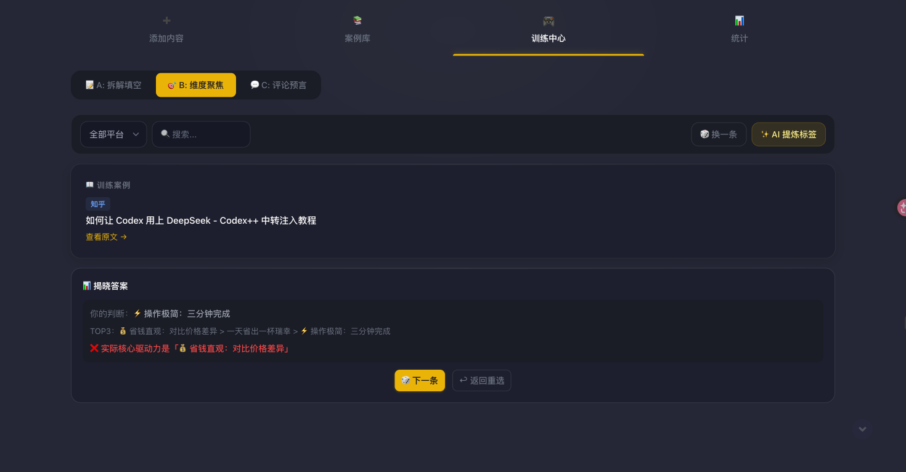
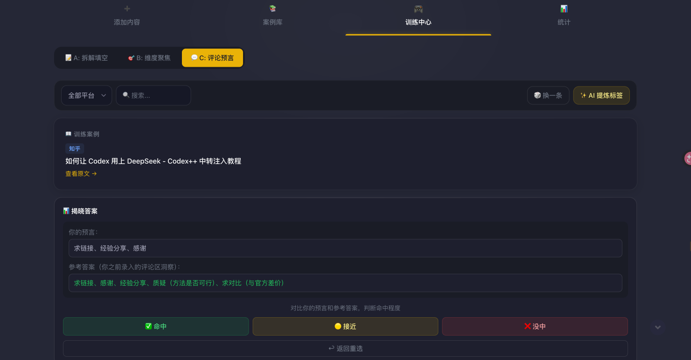
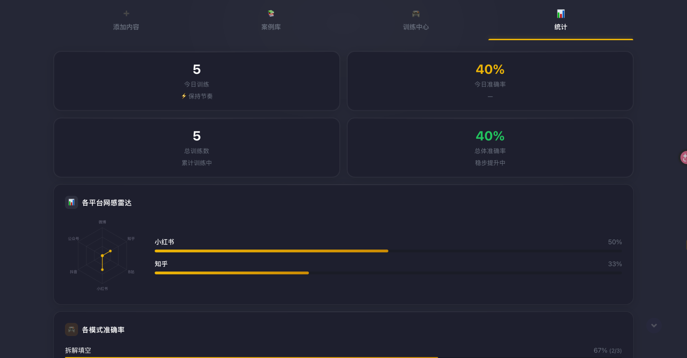

 # ✨ 网感训练板 / net-sense-trainer

> 把网感从玄学变成可训练的能力

  

  
  
  
  

---

## 这是什么？

「网感训练板」是一个面向内容创作者的刻意练习工具。每次刷到爆款，不再是"觉得不错"然后划走——而是用统一的三维度框架拆解它，用 AI 六步法给它打分，然后拿真实数据来验证你的判断。

**核心逻辑：拆解 → 预测 → 验证 → 校准。把"感觉"变成可追踪的数据。**

  
  
  

  
  
  

  
  

---

## ✨ 功能特性

| 功能 | 说明 |
|------|------|
| 🤖 **AI 六步评分** | 赛道识别 → 基准分 → 自适应权重 → 百分位 → 传播力 → 结构化理由 |
| 📝 **一键采集** | 粘贴链接 AI 自动解析，Bookmarklet 浏览器一键抓取 |
| 🔍 **结构化拆解** | 钩子强度、情绪触发、可复用结构、评论区洞察，四维拆到底 |
| 🎮 **三种训练模式** | A：拆解填空 / B：维度聚焦 / C：评论预言 |
| 📊 **网感雷达图** | 22 平台独立评分权重，六边形雷达图可视化强弱项 |
| 🏷️ **案例级标签** | 每个案例独立标签体系，不同内容显示不同标签，告别千篇一律 |
| 🔒 **隐私优先** | 纯浏览器本地存储，API Key 与数据永远不出本地 |

---

## 🎯 5D 网感训练法

| 阶段 | 动作 | 工具 |
|------|------|------|
| **Detect** 识别 | 发现值得分析的内容 | Bookmarklet / 粘贴链接 |
| **Deconstruct** 拆解 | 钩子 + 情绪 + 结构三维分析 | AI 解析 + 人工校准 |
| **Decide** 判断 | 不知答案的状态下做预测 | 三种训练模式 |
| **Diff** 对比 | 提交后立即看参考答案 | 准确率标记（命中/接近/偏差）|
| **Drill** 强化 | 薄弱平台多练 | 平台雷达图追踪 |

---

## 🚀 使用方法

1. 打开 [在线版](https://lillltachen.github.io/net-sense-trainer/) 或双击 `index.html`
2. 粘贴内容链接（或手动输入），点击「🤖 解析」让 AI 帮你拆解
3. 保存后进入「训练中心」，随机抽取案例开始练习
4. 在「统计」面板追踪准确率和平台雷达图

### AI 配置

| 配置项 | 说明 | 默认值 |
|--------|------|--------|
| API Key | OpenAI / Kimi / 自定义密钥 | — |
| Base URL | API 服务地址 | `https://api.openai.com` |
| 模型 | 任意兼容 OpenAI 格式的模型 | `gpt-4o` |

> 💡 兼容任意 OpenAI 格式接口。点击「更多 → API 设置」即可配置。

---

## 📐 平台差异化评分

不存在万能标题——不同平台的爆款逻辑完全不同：

| 平台 | 钩子 | 情绪 | 结构 | 一句话 |
|------|:---:|:---:|:---:|------|
| 微博 | 45% | 35% | 20% | 前 5 字定生死 |
| 抖音 | 50% | 30% | 20% | 前 3 秒决定完播率 |
| 小红书 | 30% | 40% | 30% | 情绪共鸣是裂变核心 |
| 知乎 | 15% | 25% | 60% | 信息密度是护城河 |
| 公众号 | 20% | 30% | 50% | 打开率 + 完读率双指标 |
| B 站 | 35% | 30% | 35% | 封面标题双钩 + 内容深度 |

---

## 🛠 技术栈

- **Vanilla HTML/CSS/JS** — 单文件 ~3670 行，零框架依赖
- **localStorage** — 数据纯本地，无需后端
- **OpenAI 兼容 API** — 支持任意 LLM provider
- **FastAPI + SQLite（可选）** — 后端热点爬虫

---

## 👤 开发者

由 **LillltaChen** 设计开发

- GitHub: [@LillltaChen](https://github.com/LillltaChen)
- 在线使用: [lillltachen.github.io/net-sense-trainer](https://lillltachen.github.io/net-sense-trainer/)

---

## 📄 License

MIT License
